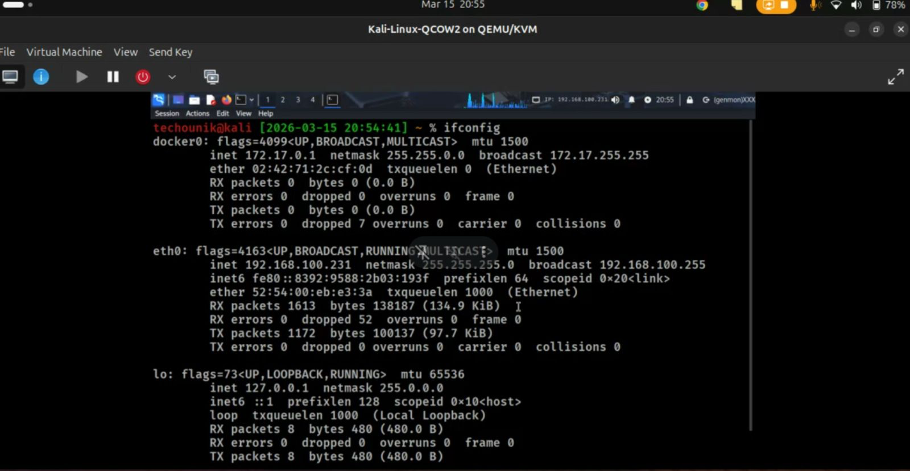
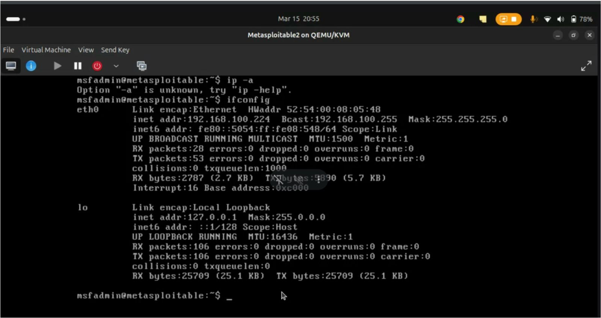
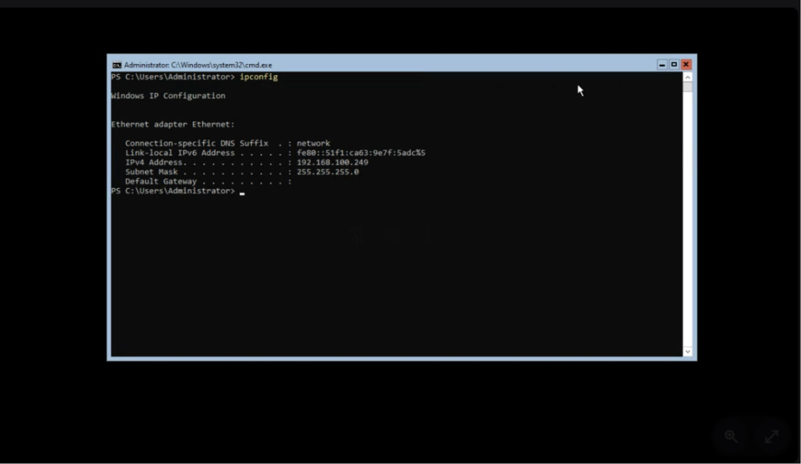

# Security Assessment Report: Lab 1 - Virtual Lab Setup & Configuration
**Environment:** Decentralized Academic Lab Network (Local Workstation Hosting)

## What We Did
We provisioned our core infrastructure directly on the personal computers of our group members, treating the setups like localized developer environments. We spun up Kali Linux, Metasploitable2, and a Windows Server box using QEMU/KVM. To simulate an air-gapped production segment safely on our host machines, we built a custom "Isolated" subnet (192.168.100.0/24). We bound all VM network adapters to this local interface to ensure vulnerable targets couldn't route out to the public internet. After verifying inter-VM routing, we fired off a baseline port scan to map the network state.

## Commands & Flags
* `ip a`
    * *(No flags)*: Modern Linux command (used on Kali) to dump all network interface configurations. We used this to verify our assigned IP on the `192.168.100.0/24` subnet and confirm the absence of a routing gateway.
* `ifconfig`
    * *(No flags)*: Legacy Linux command (used on Metasploitable2) to display active network interfaces and IP allocations.
* `ipconfig`
    * *(No flags)*: Windows command line utility used to display the IP address, subnet mask, and default gateway for all adapters.
* `nmap -sS -p- -T4 -oA baseline_scan 192.168.100.0/24`
    * `-sS`: TCP SYN scan. Sends incomplete TCP connections to stealthily check for open ports.
    * `-p-`: Instructs Nmap to scan all 65,535 ports, not just the top 1,000.
    * `-T4`: Aggressive timing template. Speeds up the scan, assuming we're on a fast, local network with no latency.
    * `-oA baseline_scan`: Outputs the results into all three major formats (.nmap, .xml, and .gnmap) using the base filename provided.

## The Results (-Group0-Ethical-Hacking-Labs/Lab 1 (Setup)/baseline_scan.nmap)
The lab environment was successfully built, isolated, and secured on our local hardware. The attacker machine identified and communicated with the targets, and we established a clean baseline of the local subnet for diffing against future state changes.

### 1. Kali IP Configuration

*Figure 1: Kali Linux interface configuration showing local subnet allocation with no external routing.*

### 2. Metasploitable IP Configuration

*Figure 2: Metasploitable2 interface configuration confirming internal routing only.*

### 3. Windows IP Configuration

*Figure 3: Windows Server ipconfig output explicitly showing a blank Default Gateway, validating the isolated network state.*

