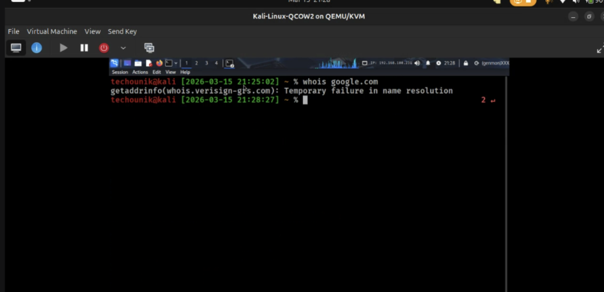
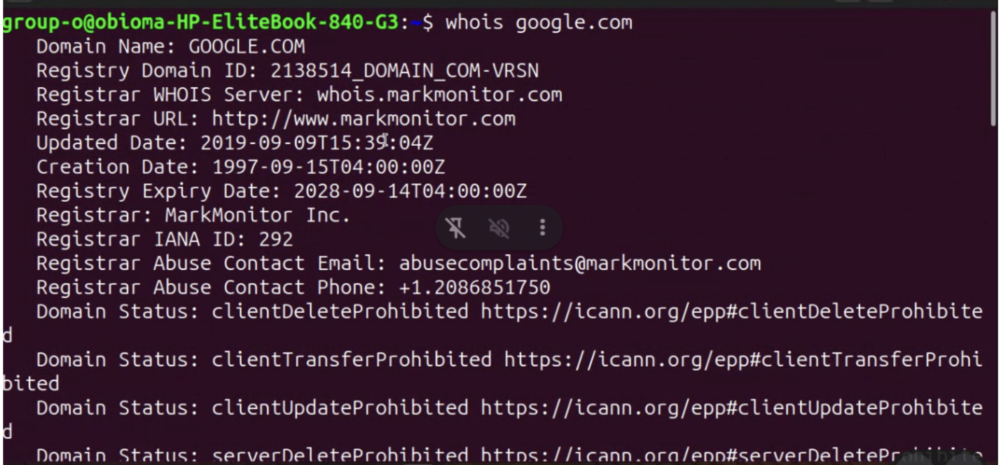
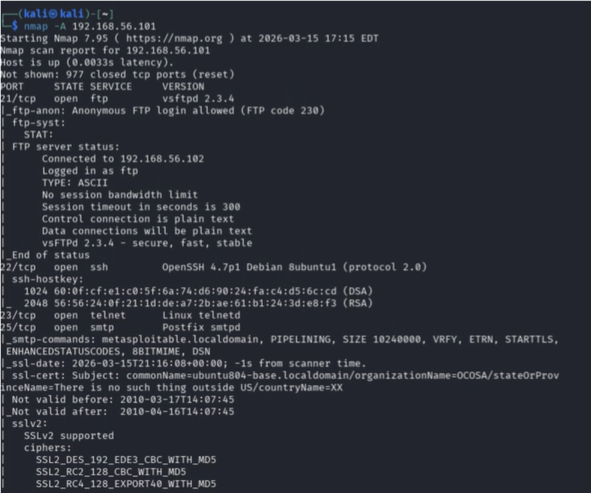
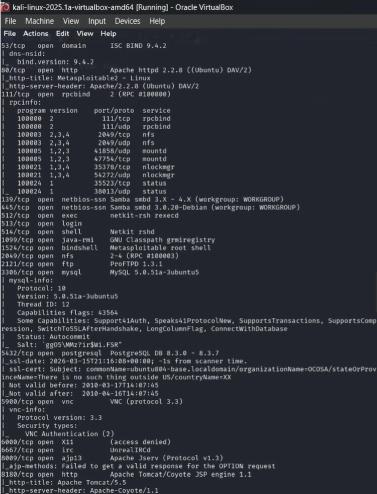
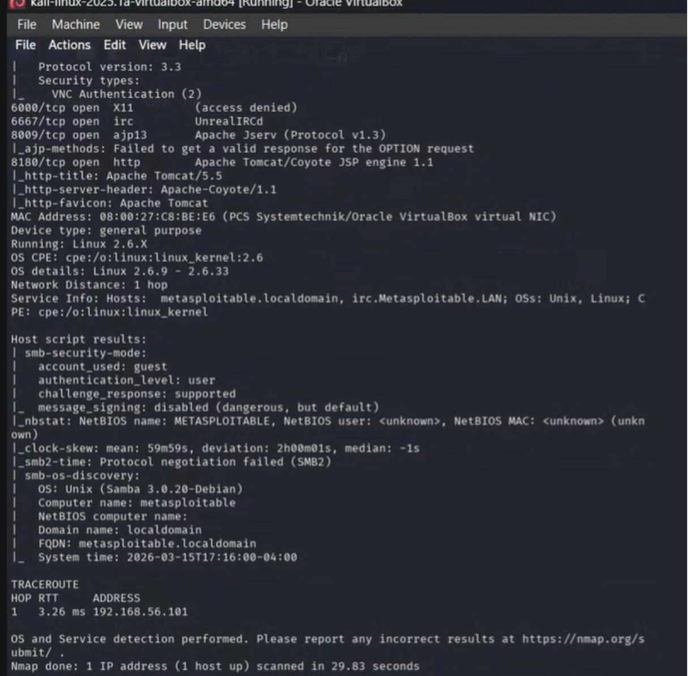
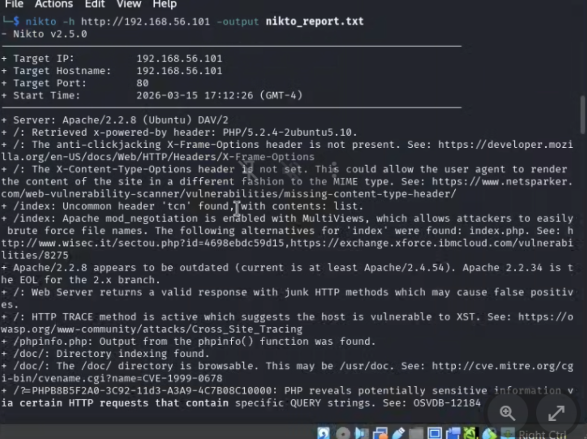
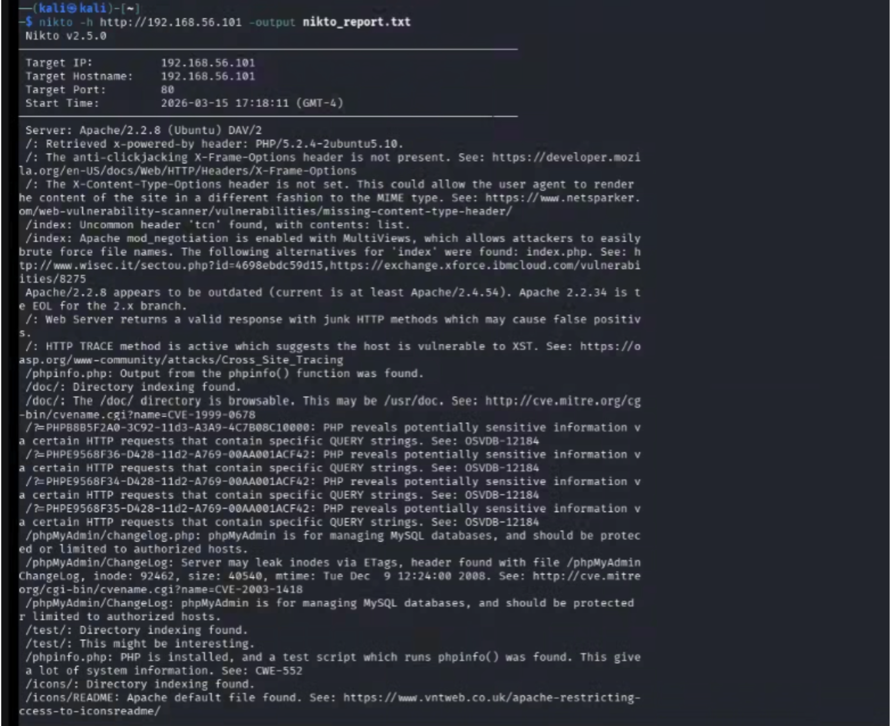
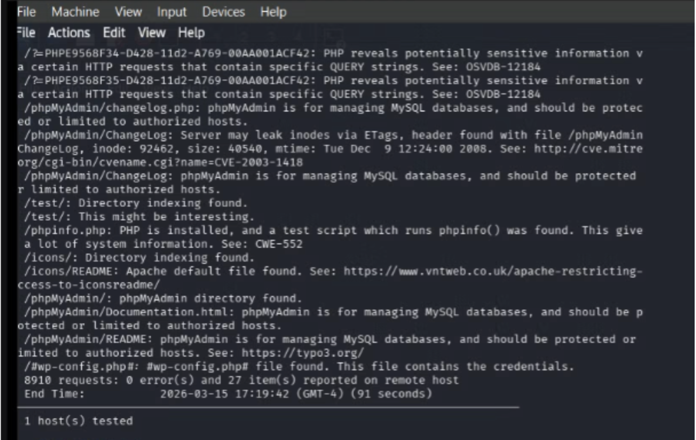

# Security Assessment Report: Lab 2 - Footprinting & Reconnaissance
**Environment:** Decentralized Academic Lab Network (Local Workstation Hosting)

## What We Did
In a standard engagement, we’d start with passive OSINT. But because our local Host-Only networks are intentionally air-gapped, standard DNS enumeration tools failed to reach out. We pivoted to active reconnaissance and threw an aggressive OS-fingerprinting scan at the targets. Port 80 hung on the primary VM, so instead of burning time troubleshooting local hypervisor bugs on that specific machine, we swapped over to a teammate's working local instance. Against that functional server, we ran a web vulnerability scanner to hunt for low-hanging fruit.

## Commands & Flags
* `whois [target]`
    * *(No flags)*: Queries the public WHOIS databases to extract domain registration, ownership, and network allocation data for the target.
* `nmap -sS -sV -O -p 1-65535 -T4 192.168.100.x`
    * `-sS`: TCP SYN stealth scan.
    * `-sV`: Service version detection. Probes open ports to see exactly what software and version is running.
    * `-O`: Enables OS detection by analyzing TCP/IP fingerprinting responses.
    * `-p 1-65535`: Scans the entire port range.
    * `-T4`: Aggressive timing template.
* `nikto -h http://192.168.100.x -output nikto_report.txt`
    * `-h`: Specifies the target host or URL to scan.
    * `-output`: Directs the tool to write the vulnerability findings into a designated text file.

## The Results
We mapped out the target's basic services and successfully identified potential web vulnerabilities despite the initial local virtualization issues. We took this intelligence and built an accurate visual map of the local attack surface.

### 1. Whois Enumeration

*Figure 1: Failed because we were in an isolated network.*

*Figure 2: Successful query after a secondary network adapter was added to route out to the public internet.*

---

### 2. Nmap Service & OS Scan

*Figure 3: Nmap aggressive scan execution and initial port discovery.*

*Figure 4: Nmap service version and OS detection results.*

*Figure 5: Nmap scan completion and routing summary.*

---

### 3. Nikto Web Vulnerability Scan

*Figure 6: Nikto scan initiation and server header enumeration.*

*Figure 7: Nikto vulnerability findings and directory enumeration.*

*Figure 8: Nikto scan completion and final report generation.*