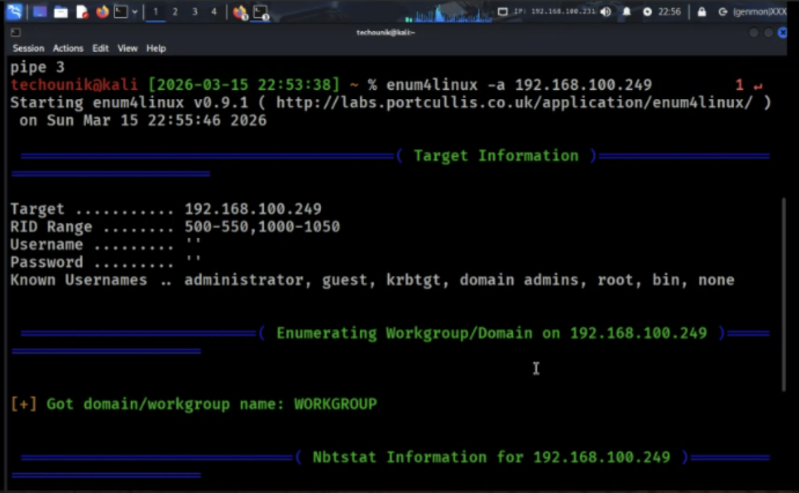
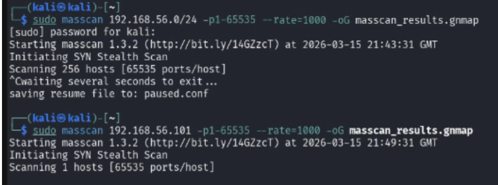
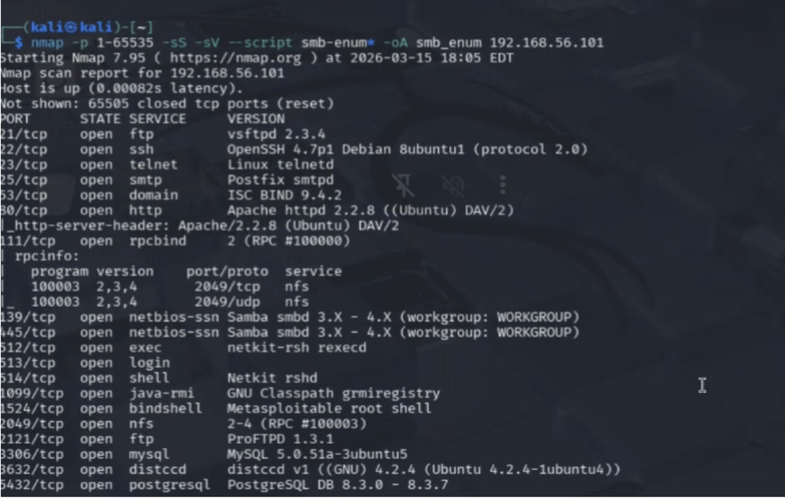
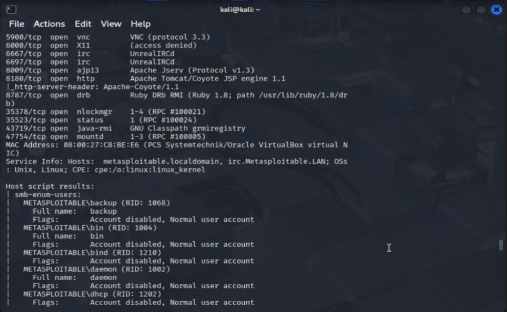
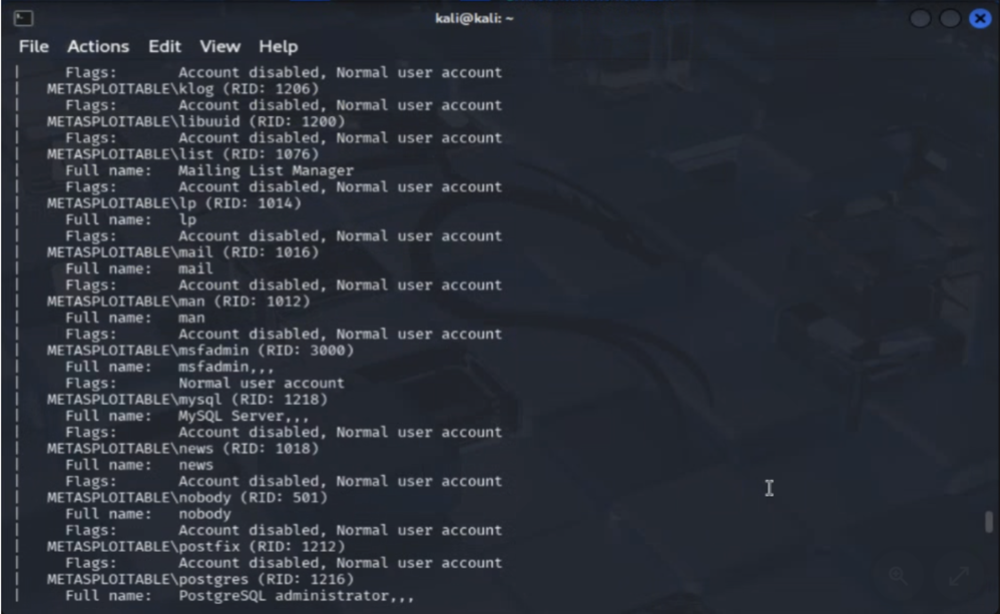
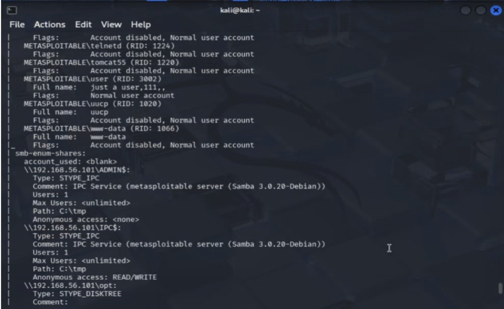
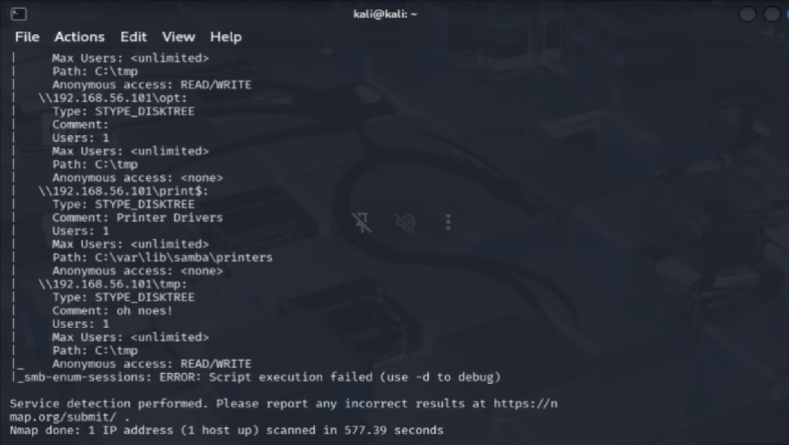

# Security Assessment Report: Lab 3 - Network Scanning & Enumeration
**Environment:** Decentralized Academic Lab Network (Local Workstation Hosting)

## What We Did
We initiated this phase with a rapid TCP sweep to grab a quick baseline of available services across the local subnet. Because we knew the original machine had configuration issues, we focused our deep enumeration entirely on the functional Metasploitable host running on our teammate's PC. We followed up the sweep by running targeted Nmap Scripting Engine (NSE) scripts against the SMB service to pull down file shares and user accounts.

## Commands & Flags
* `masscan 192.168.100.0/24 -p1-65535 --rate=1000 -oG masscan_results.gnmap`
    * `-p1-65535`: Targets all possible ports.
    * `--rate=1000`: Caps the transmission rate at 1,000 packets per second so we don't crash our local routers.
    * `-oG`: Outputs results in a greppable format for easy parsing.
* `nmap -p 1-65535 -sS -sV --script smb-enum* -oA smb_enum 192.168.100.x`
    * `--script smb-enum*`: Instructs Nmap to run all Lua scripts matching the "smb-enum" wildcard pattern to aggressively enumerate Samba data.
* `enum4linux -a 192.168.100.x`
    * `-a`: Do "All" simple enumeration. This is a macro flag that automatically runs a full suite of checks including: extracting userlists (`-U`), enumerating shares (`-S`), grabbing password policies (`-P`), and checking for OS information (`-o`) via null sessions.

## The Results
We successfully extracted user accounts, underlying RPC data, and open shares from the target's Samba service. By utilizing `enum4linux`, we confirmed the target allowed anonymous null sessions, which dumped the internal user list and password policy. We cross-referenced the discovered software versions and misconfigurations against known CVEs to define our exact paths for exploitation.

