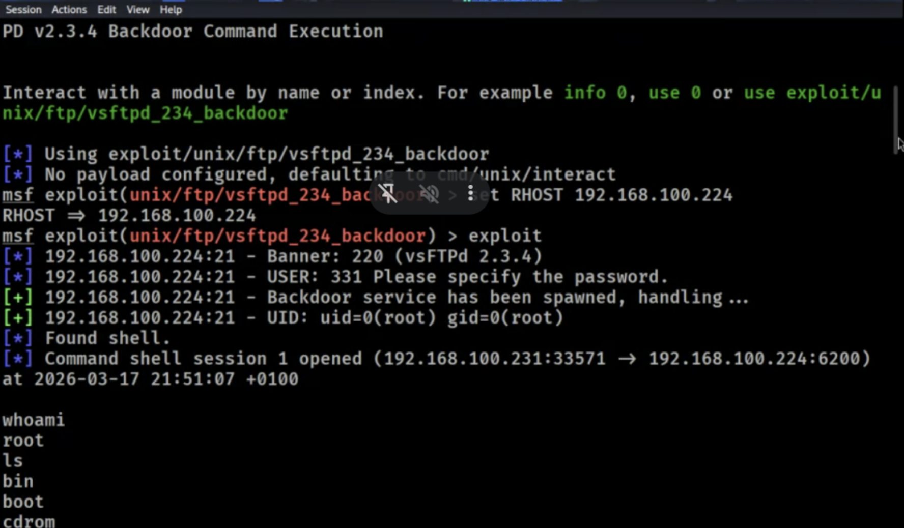

# Security Assessment Report: Lab 4 - Exploitation & Post-Exploitation
**Environment:** Decentralized Academic Lab Network (Local Workstation Hosting)

## What We Did
Enumeration confirmed the target ran vsftpd version 2.3.4, which has a notorious backdoor (CVE-2011-2523). We loaded the exploit in Metasploit and popped a remote shell. The initial connection was a "dumb" shell, so we used Python to upgrade it to a fully interactive TTY. Once inside, we pulled system information and dumped the local password file as proof of access. We didn't even have to escalate privileges; checking our sudo rights showed we already had root.

## Commands & Flags
* `python -c 'import pty; pty.spawn("/bin/bash")'`
    * `-c`: Tells Python to execute the command string provided rather than opening an interactive interpreter. Spawns a stable pseudo-terminal.
* `uname -a`
    * `-a`: Prints all available system information (kernel name, network node hostname, kernel release, architecture).
* `sudo -l`
    * `-l`: Lists the allowed (and forbidden) sudo commands for the current user. Confirmed root privileges.

## The Results
We bypassed authentication entirely and secured a stable root shell. In a production environment, relying on this FTP service is a critical risk. 

**Remediation Plan:**
* **Patching:** Upgrade vsftpd to the latest patched release or uninstall it entirely.
* **Protocol Migration:** Deprecate plain FTP (which sends data in cleartext) and replace it with SFTP.
* **Access Control:** Implement strict host-based firewall rules (iptables/ufw) to drop external connections to the backdoor's bind port (TCP 6200) and restrict Port 21 to trusted internal IPs.

