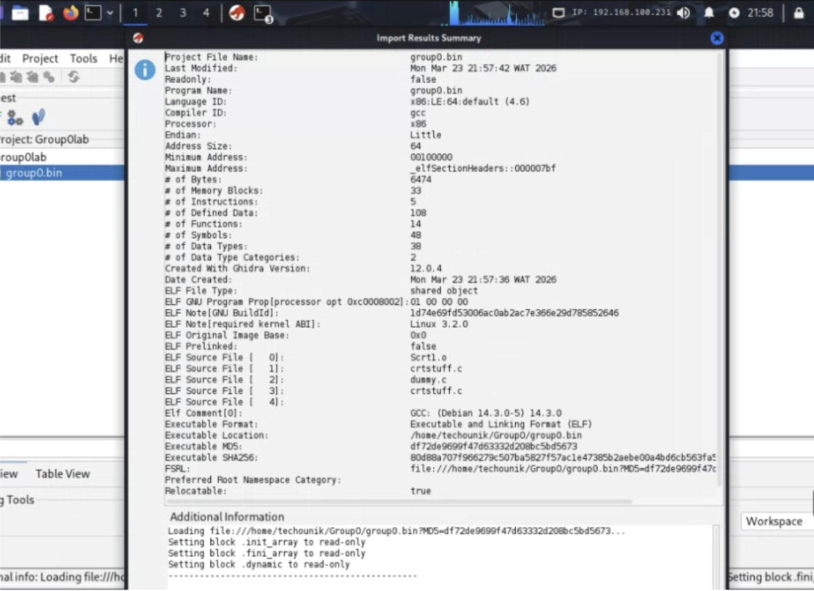
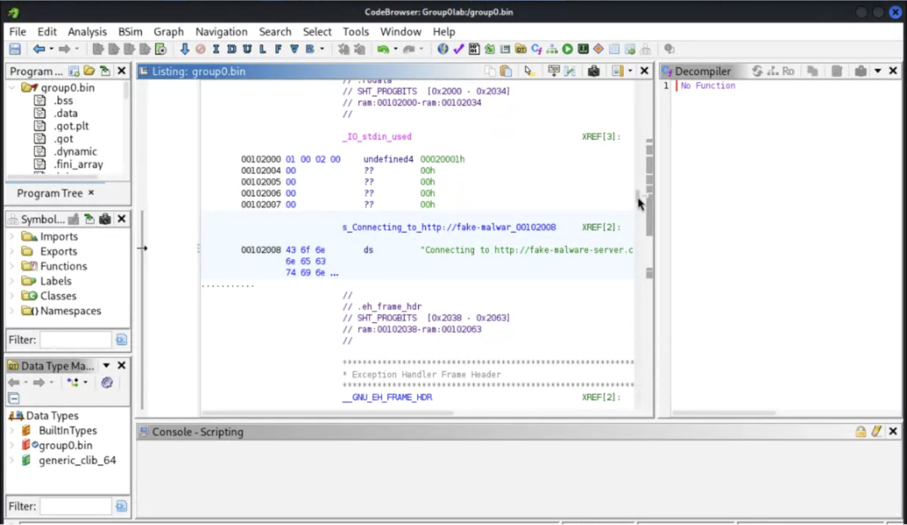
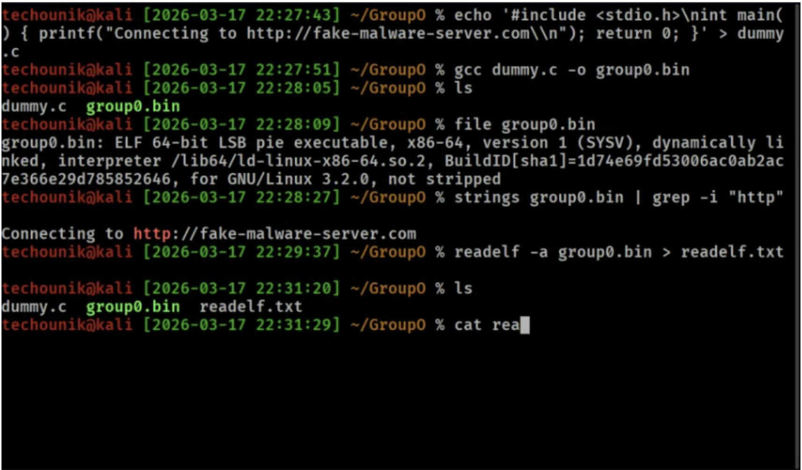
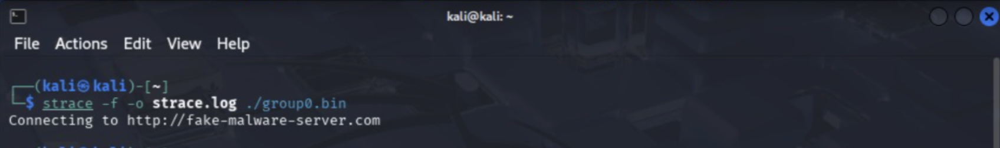

# Security Assessment Report: Lab 5 - Malware Analysis & Reverse Engineering
**Environment:** Decentralized Academic Lab Network (Local Workstation Hosting)

## What We Did
Because the original lab malware sample was missing, we engineered and compiled our own simulated binary (`group0.bin`). We started our static analysis by verifying the file architecture, extracting printable strings to hunt for hardcoded URLs, and dumping the executable's internal headers and sections into a text file for review. We then launched the Ghidra GUI in the background to decompile the binary into readable C code.

For dynamic analysis, we safely executed the binary inside our air-gapped local setup. Instead of just watching the terminal, we traced all system calls (including child processes) and wrote the output directly to a log file. Simultaneously, we captured all network traffic across all interfaces to record the simulated command-and-control (C2) traffic, saving the raw PCAP for later analysis.

## Commands & Flags
* `file group0.bin`
    * *(No flags)*: Analyzes the file header and magic numbers to determine the exact file type and architecture (e.g., 32-bit vs 64-bit ELF executable).
* `strings sample.bin | grep -i "http"`
    * *(No flags on strings)*: Extracts all printable character sequences from the binary.
    * `|`: Pipes the output directly into the grep search.
    * `-i`: Tells `grep` to perform a case-insensitive search for the string "http".
* `readelf -a group0.bin > readelf.txt`
    * `-a`: "All". Instructs the tool to dump all available information about the ELF file, including section headers, symbol tables, and imported libraries.
    * `>`: Redirects the massive terminal output into a clean text file for easier analysis.
* `ghidraRun &`
    * `&`: Executes the Ghidra GUI application as a background process, allowing us to continue using the current terminal window for other commands.
* `strace -f -o strace.log ./group0.bin`
    * `-f`: "Follow forks". Critically important for malware analysis, this ensures `strace` tracks any child processes the malware attempts to spawn, not just the parent executable.
    * `-o`: Directs the tool to write the system call trace into `strace.log` instead of flooding the terminal screen.
* `tcpdump -i any -w sample_capture.pcap > sample_capture.txt`
    * `-i any`: Instructs the packet sniffer to capture traffic on *all* available network interfaces simultaneously, rather than just `eth0`.
    * `-w`: Writes the raw captured packets directly to a binary file for later analysis in Wireshark or `tshark`.    
    * `>`: Standard bash redirect. Pushes the terminal output into a readable text file.

## The Results
We safely detonated the binary, mapped its system interactions (including child processes), and successfully extracted the raw C2 network traffic. By combining static analysis (headers, strings, and Ghidra decompilation) with dynamic behavioral logging, we generated clear Indicators of Compromise (IOCs) that a blue team could use to write defensive detection rules.

> **Note:** Full console output and command results have been logged to `Lab5.txt`, `readelf.txt`, `samplecapture.txt` and `Lab5Guidra.txt`for reference.