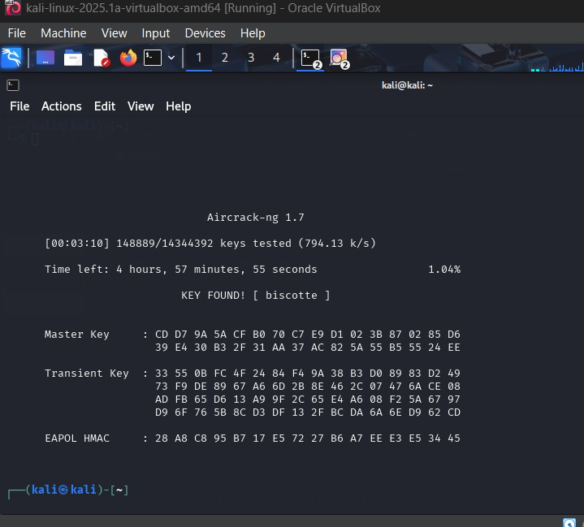
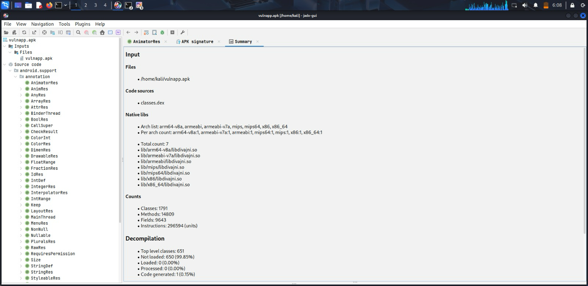

# Security Assessment Report: Lab 7 - Wireless & Mobile Security
**Environment:** Decentralized Academic Lab Network (Local Workstation Hosting)

## What We Did
Running QEMU virtualized environments locally on our PCs abstracts the host Wi-Fi adapter into a wired `eth0` connection. This hardware limitation breaks wireless monitoring tools like `airmon-ng`. To adapt to the environment, we pulled down an educational WPA2 handshake capture and a vulnerable mobile app (`DivaApplication.apk`) for offline analysis. We cracked the handshake via dictionary attack, then decompiled the APK to hunt for hardcoded developer secrets.

## Commands & Flags
* `aircrack-ng -w /usr/share/wordlists/rockyou.txt handshake_capture-01.cap`
    * `-w`: Specifies the path to the dictionary/wordlist file used to brute-force the cryptographic hash.
* `apktool d vulnapp.apk -o vulnapp_src`
    * `d`: Decode. Tells the tool to decompile the packaged APK back into readable source code directories.
    * `-o`: Specifies the output directory for the decompiled files.
* `grep -ir "password" res/values/`
    * `-i`: Case-insensitive search.
    * `-r`: Recursively searches through all files and subdirectories inside `res/values/`.

## The Results
We successfully executed an offline dictionary attack to recover the WPA2 key. Moving to mobile, we successfully decompiled the Android application and extracted sensitive developer credentials that were hardcoded in plain text in the app's XML files.

> **Note:** Full console output and command results have been logged to `Lab7A.txt` and `Lab7B.txt`for reference.