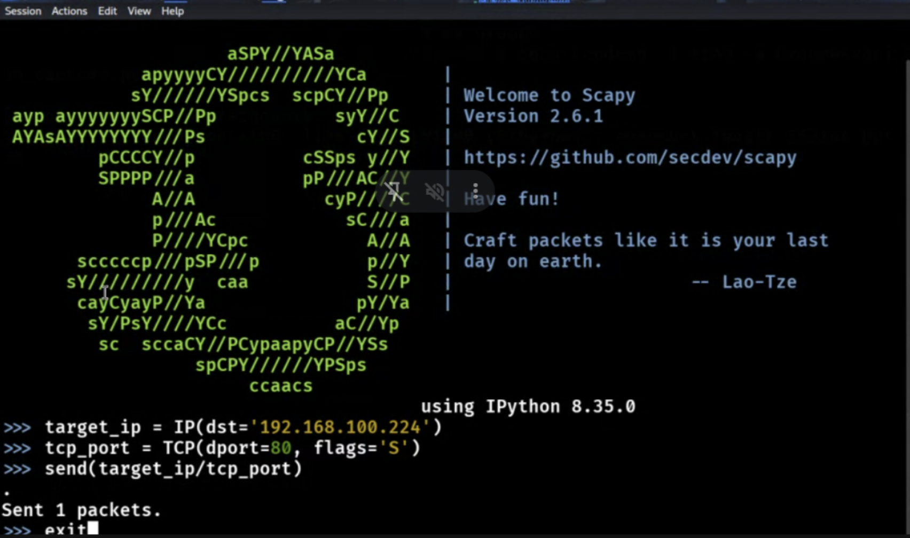
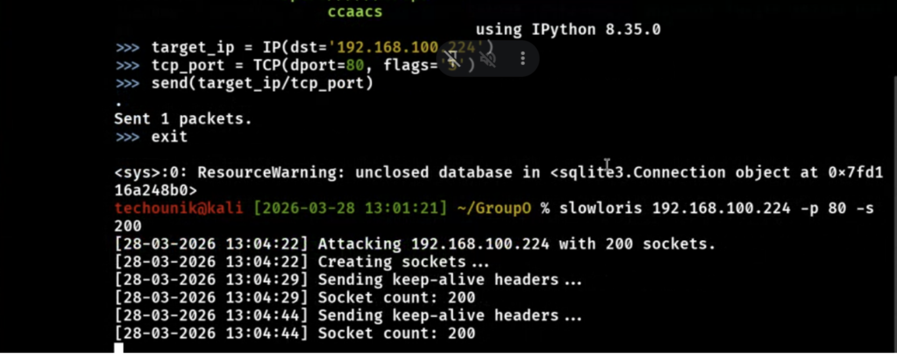

# Security Assessment Report: Lab 8 - Evasion & DDoS Simulation
**Environment:** Decentralized Academic Lab Network (Local Workstation Hosting)

## What We Did
We ran a background capture to generate an evidentiary artifact while testing evasion. First, we intentionally fragmented our scan packets to bypass hypothetical IDS signatures. We then dropped into Python (`scapy`) to manually forge network traffic from scratch. Next, we simulated an application-layer DoS attack with slowloris, tying up the server with slow keep-alive requests rather than a loud flood. Finally, we stopped the capture and used `tshark` to parse the specific packet fields into a clean text file so we could prove our techniques actually hit the wire.

## Commands & Flags
* `tcpdump -i eth0 -w evasion_capture.pcap`
    * `-i eth0`: Listens on the primary network interface.
    * `-w`: Writes the captured traffic to a binary file.
* `nmap --mtu 24 -sS 192.168.100.224`
    * `--mtu 24`: Sets a custom Maximum Transmission Unit, chopping the scan packets into tiny 24-byte fragments to obscure the attack signature from packet inspectors.
    * `-sS`: TCP SYN scan.
* `scapy` (Interactive Session)
    * `target_ip = IP(dst='192.168.100.224')`: Constructs the Network layer (Layer 3), defining the exact destination IP address.
    * `tcp_port = TCP(dport=80, flags='S')`: Constructs the Transport layer (Layer 4), targeting port 80 and setting the 'S' (SYN) flag to simulate the start of a handshake.
    * `send(target_ip/tcp_port)`: Uses the `/` operator to stack the protocol layers together, then transmits the manually forged packet over the wire.
* `tshark -r evasion_capture.pcap -T fields -e frame.time -e ip.src -e ip.dst -e tcp.flags > evasion_summary.txt`
    * `-r`: Reads the capture file.
    * `-T fields`: Changes the output format to only show specific packet fields instead of standard text dumps.
    * `-e`: Specifies exactly which fields to extract (we pulled timestamps, source/dest IPs, and TCP flags).
    * `>`: Redirects the cleanly formatted data into a text file for our final report.

## The Results
We successfully simulated advanced network evasion and manual packet forging. We executed a resource-exhaustion DoS attack without flooding our local host networks, and converted the raw pcap data into readable text summaries to validate our methodology.

### 1. Manual Packet Forging (Scapy)

*Figure 1: Interactive Scapy session demonstrating the manual, layer-by-layer construction and transmission of a custom TCP SYN packet to evade standard detection signatures.*

### 2. Application-Layer DoS Simulation

*Figure 2: Executing Slowloris against the target web server. This simulates a resource-exhaustion attack by opening and holding hundreds of connections, effectively denying service without a massive flood of traffic.*

> **Note:** Full command results have been logged to `Group0readable_capture.txt` for reference.
